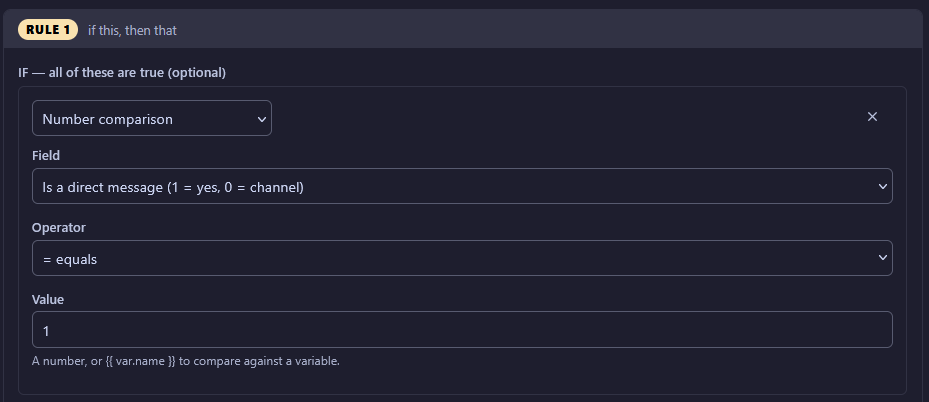

Direct/PUBLIC messages

* Place files in \AppData\Roaming\MeshMonitor\scripts
* .env file
* Replace "YOUR_WEBHOOK_TOKEN_HERE" with your Discord webhook token
* Replace "YOUR_WEBHOOK_ID_HERE" with your Discord webhook id

Automation engine settings

* Trigger - A message is received
* Action run script DM/PUBLIC
(for DM messages use RULE number comparison and "is a direct message" true)
* Script CLI arguments
* --snr "{{ trigger.snr }}" --rssi "{{ trigger.rssi }}" --hops "{{ trigger.hops }}" --fromName "{{ trigger.fromName }}" --text "{{ trigger.text }}"

